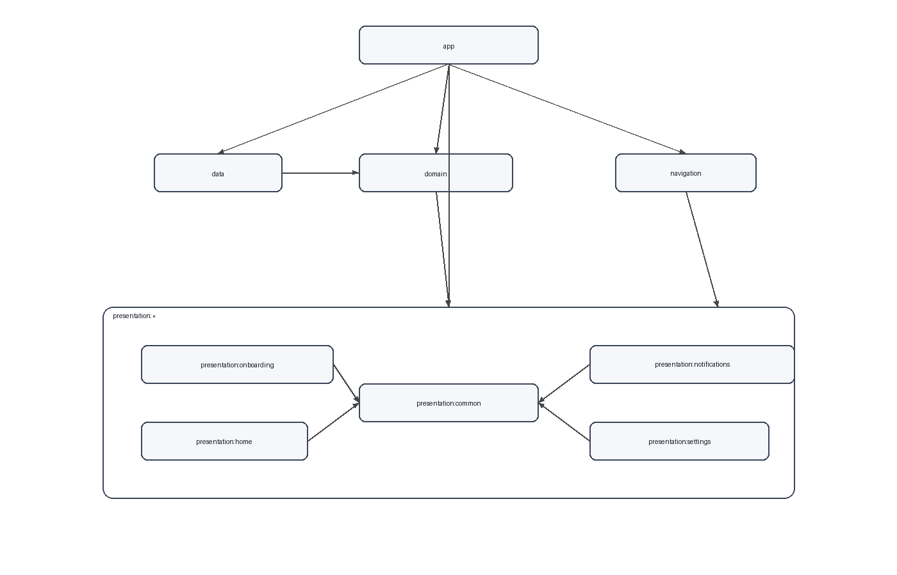

# NotificationFlow

Tracking Notification Android App.

## Privacy
- All notifications are stored locally on the device.
- The app does not send notifications to any server or public network.
- No public data sharing, to avoid potential user harm.

## Tech Stack
- Kotlin
- Jetpack Compose (UI)
- Clean Architecture
- Hilt (DI)
- Jetpack DataStore (local preferences)
- Room (local database)
- Coroutines + Flow

## Modules
- `app`: Application entry, wiring, build config.
- `domain`: Use cases, repository interfaces, models, constants.
- `data`: Repository implementations, data sources, exporters.
- `navigation`: Graphs, routes, navigation models.
- `presentation/common`: Shared UI, theming, common utilities.
- `presentation/home`: Home feature UI.
- `presentation/notifications`: Notifications feature UI.
- `presentation/settings`: Settings feature UI.
- `presentation/onboarding`: Onboarding flow.

## Module Dependencies

