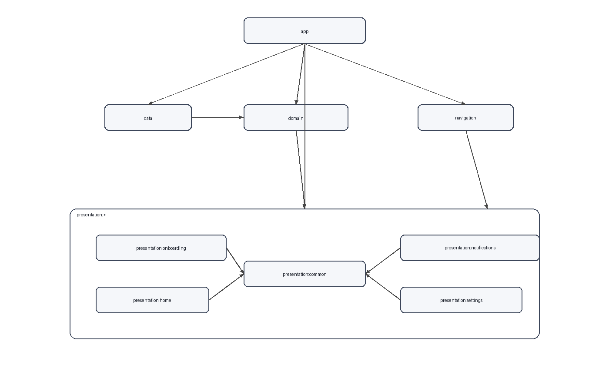

# NotificationFlow

Tracking Notification Android App.

## Privacy
- All notifications are stored locally on the device.
- The app does not send notifications to any server or public network.
- No public data sharing, to avoid potential user harm.

## Tech Stack
- Kotlin
- Jetpack Compose (UI)
- Clean Architecture
- Hilt (DI)
- Jetpack DataStore (local preferences)
- Room (local database)
- Coroutines + Flow

## Modules
- `app`: Application entry, wiring, build config.
- `domain`: Use cases, repository interfaces, models, constants.
- `data`: Repository implementations, data sources, exporters.
- `navigation`: Graphs, routes, navigation models.
- `presentation/common`: Shared UI, theming, common utilities.
- `presentation/home`: Home feature UI.
- `presentation/notifications`: Notifications feature UI.
- `presentation/settings`: Settings feature UI.
- `presentation/onboarding`: Onboarding flow.

## Module Dependencies

## Notification Filters Behavior
- `Allow all`: collect notifications from all apps.
- `Block selected`: block notifications from selected packages.
- `Allow only selected`: collect notifications only from selected packages.
- Filter rules apply to new notifications only.
- In `Block selected` and `Allow only selected`, users can quickly filter the app list by `All`, `Allowed`, or `Blocked`.
- UI edits are draft-only until the user taps `Apply changes`.
- Leaving the screen with unapplied changes shows a discard confirmation.
- `Reset to default` requires confirmation and resets draft state to default mode (`Allow all`) with empty selections.
- App selections are kept separately per mode, so switching modes does not overwrite the other mode's draft selection.
